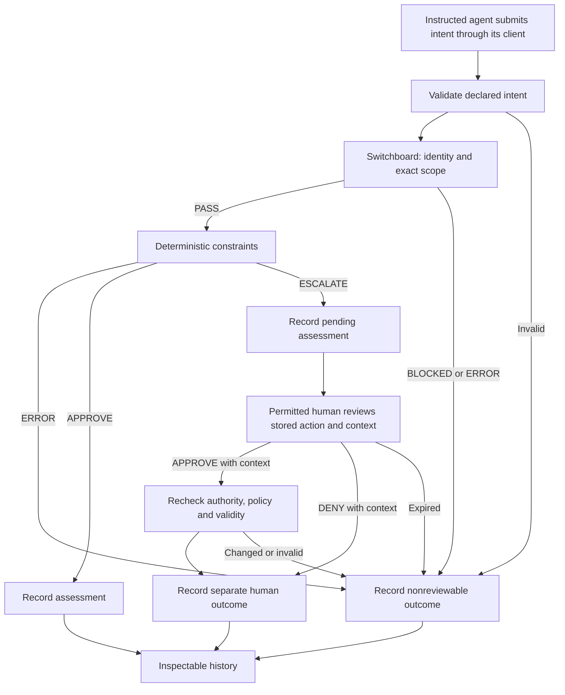

# Apex build plan

**Version:** 0.3 — proposed full-workflow sequence with v0.0.2 implementation status, 2026-09-10

**Purpose:** build Northstar's third-party transparency layer from the pinned APEX-Lite source, retaining the Apex Switchboard already implemented and tested.

An agent declares a concrete intent. A separately controlled system verifies its identity and authority, applies deterministic constraints, routes only permitted conditions to a human, and makes the decision understandable from its records. This is the product we are building.

The [Northstar roadmap](../docs/roadmap/transparency-layer.md) owns product direction. This file owns **Apex's implementation sequence and milestone checks**. The [foundation design](design/0001-foundation.md) explains the architecture, and the [first workflow](design/first-workflow.md) describes the participant experience. Future milestones below are planned work, not implemented capabilities or security acceptance.

## Current increment — Auditor v0.0.2

Robert requested a light third-party auditor with deterministic human rule entry and clarified that the decision gate should only APPROVE or ESCALATE. [Apex Auditor v0.0.2](docs/auditor-v0.0.2.md) provides local operator sign-in, principal-bound temporary agent credentials, Switchboard-first assessment, exact `APPROVE` / `ESCALATE` rules, version-checked policy/registry saves, and a journal-backed human review. An authenticated operator records APPROVE or DENY on a saved escalation with required context. Run `npm run demo:auditor` for its synthetic registry.

Robert further clarified the participant workflow: the agent receives portable instructions and submits intent automatically through the [agent client](docs/agent-integration.md); the human page manages rules, enrollment, reviews, and audit. A [copyable template](docs/agent-instructions.md) and principal-scoped status API connect those roles. Manual submission is retained in a collapsed developer console. This remains v0.0.2 and a cooperative integration; Markdown does not install runtime interception or force mediation. Existing verification reports retain their exact recorded source and do not automatically verify this added path.

This is a bounded increment across the foundations of A1–A6. It checks only `{agentId, action, target}` and offers one local operator role. Full material-action binding, trusted-context conditions, per-condition human routes, expiry, request idempotency, external deployment, and execution remain open. No complete milestone or security acceptance is established by this increment. The [v0.0.1 verification](test/reports/auditor-v0.0.1-2026-09-10/REPORT.md) remains historical evidence for its original source.

The gate business outcomes are APPROVE/ESCALATE. Authority failures become top-level BLOCKED while preserving underlying Switchboard DENY, and invalid evaluations remain ERROR. BLOCKED and ERROR never enter human review. A context comment does not establish missing facts or authority; authentication, exact assessment binding, single resolution, and approval-time checks provide the current controls.

## Starting point

APEX-Lite source: **Trust-Layer-AI/Trust-Engine**, commit `b0dadd6d0f9c08f7c74e8524d324afd4623610aa`, package `apex-lite` 0.1.0. Its 29 files remain unchanged under [reference/apex-lite/](reference/apex-lite/), with original license and [per-file provenance](reference/apex-lite.manifest.json). All new work belongs outside that snapshot.

| Available now | Evidence and practical boundary |
| --- | --- |
| [Switchboard](src/switchboard.js) | Credential verification, whitelist, and exact action-target grants. [Foundation report](test/reports/switchboard-foundation-2026-09-09.md): 28 tests passed for the recorded source. PASS only advances to constraint screening. |
| [Ten-process stress experiment](test/reports/stress-20260910T042441767Z-25990a2a.md) | 10,000 pings reconciled. Evidence for the recorded local load and screening module. |
| [Actual AI-agent experiment](test/reports/ai-live-20260910T043406057Z/REPORT.md) | Cedar and Maple made 20 tool calls with correct results and matching records. Guided integration evidence; no human workflow or execution. |
| [Auditor v0.0.2](docs/auditor-v0.0.2.md), [server](src/server.js), [gate](src/gate.js), and [journal](src/auditor-store.js) | Implemented local operator/agent separation, APPROVE/ESCALATE rules, exact scope screening, assessment persistence, and human APPROVE/DENY with context. Current tests are in `test/gate.test.js` and `test/auditor.test.js`; earlier Switchboard experiments do not cover this service. |
| [Agent instructions](docs/agent-instructions.md), [connection guide](docs/agent-integration.md), [client](src/agent-client.js), and [CLI](bin/apex-agent.mjs) | Cooperative automatic intent submission and agent-owned status lookup through the real service. Human context returns as a separate review; no runtime hook, tool execution, or forced mediation is supplied. |
| Retained [operator UI](operator/README.md) and [registry validator/store](src/registry-store.js) | Grok's existing registry interface is preserved at `/index.html`. When served by the auditor, its registry API requires operator authentication and uses the auditor journal. The older operator and separate audit prototype documentation retain their original context. |
| APEX-Lite console and evaluator | Source material for the declaration, result, review queue, history, policy examples, and thin client/server structure. Its original permission and receipt semantics remain historical. |

The auditor's journal owns policy and registry after initialization and activates successful saves for subsequent assessments. Its operator key and ephemeral agent credentials are separate; an agent can request assessment without an operator session. The old `/api/credentials` token utility remains unregistered; principal binding uses `/api/gate/credentials`. This is one local server with a plain journal, not a remote deployment, tamper-proof evidence service, or same-UID security boundary.

## What comes from APEX-Lite

| Reference source | Keep or adapt | Change for Apex |
| --- | --- | --- |
| [index.js](reference/apex-lite/src/index.js): `evaluateIntent`, `normalizeIntent` | One readable orchestration entry point; a separate intake boundary | Strict, versioned material input; authenticated identity separate from a claimed name; Switchboard before constraints. No invented material defaults. |
| [engine.js](reference/apex-lite/src/engine.js), [policy.js](reference/apex-lite/src/policy.js) | Small deterministic evaluator, separate policy loading, understandable fixtures | Validate whole policies and required facts; gate APPROVE/ESCALATE, separate human APPROVE/DENY, nonreviewable authority/errors, and all applicable reasons. Lite maps `deny: true` to approval and defaults unmatched policy to ALLOW. |
| [gates.js](reference/apex-lite/src/gates.js) | Readable examples of constraint categories | Evaluate typed facts from trusted sources. Keywords in an agent's explanation, risk label, actor, or ID cannot grant permission or establish classification. |
| [public/index.html](reference/apex-lite/public/index.html), [public/app.js](reference/apex-lite/public/app.js) | Compact declaration → decision → human queue → history experience | Show verified identity, scope, constraints, and distinct states. Restore pending work from server records. Only current-model ESCALATE assessments that passed Switchboard enter human review. |
| [operator-action.js](reference/apex-lite/src/operator-action.js) | Human outcome references a stored evaluation | Authenticate the permitted reviewer; approve/reject/expire once against the exact stored action. Replace caller-supplied/default operator identity and approve/escalate-only behavior. |
| [receipt.js](reference/apex-lite/src/receipt.js), [audit.js](reference/apex-lite/src/audit.js) | Inspectable structured records and JSONL export | Linked durable state, access controls, and explicit integrity boundaries. Lite's `blocking: false` receipt and plain append log do not supply authorization or an atomic review lifecycle. |
| [server.js](reference/apex-lite/src/server.js), [CLI](reference/apex-lite/bin/apex-lite.js), [tests](reference/apex-lite/scripts/test-apex-lite.mjs) | Thin adapters and example/test organization | One shared Apex pipeline, authenticated roles, bounded input, and Apex-specific expectations. Do not copy tests assuming absent binding hashes, unauthenticated human identity, or nonblocking execution receipts. Gate and human outcomes require separate expectations. |

Adapt source deliberately, with attribution and a record of changed behavior. The initial implementation can continue in the existing Node ES-module package and browser JavaScript. A framework migration, new hosting provider, and OS-specific enforcement work are not prerequisites for these milestones.

## First complete workflow

Use the existing synthetic report-sharing scenario. An agent requests `report.share` for an identified report and recipient. The report has an opaque reference and digest; classification and recipient-verification facts come from operator-controlled context. The agent supplies material action details and an optional explanation. It cannot supply its own trusted classification or authority.

No report is sent in this milestone. The participant sees the authority result, gate APPROVE/ESCALATE decision, and any human APPROVE/DENY with context in a complete decision trail. `report.share` is a proposed full-action contract; it is not one of the current auditor's five actions.

APPROVE is a gate assessment; PASS is only Switchboard eligibility. Human APPROVE/DENY records a separate outcome on an escalation and retains its context. Neither gate nor human approval is an execution credential. Authorization issuance and observed execution remain separate future records.

## Build sequence

### A0 — Preserve the foundation · complete within its recorded scope

Keep the Lite snapshot, current Switchboard, operator prototype, fixtures, and all existing evidence. Carry forward the tested three-field Switchboard interface. Do not repeat a broad stress or enforcement campaign just to begin the next product feature.

### A1 — Define the declared-intent and decision contracts · next

**Participant result:** a precise, inspectable request whose material meaning remains the same through every stage.

**UI coordination:** Grok's existing registry UI remains preserved. The [Gate Actions handoff](docs/gate-language.md) and [action catalog](config/action-catalog.json) supply the shared vocabulary. The v0.0.2 gate enforces action IDs and exact scope rules; `materialFields` are still unvalidated design metadata. Coordinate later full-action controls against this contract and the existing auditor APIs.

- Add versioned Apex workflow schemas and valid/invalid fixtures under `schemas/` and `test/fixtures/`. Record request correlation, claimed agent, action, exact scope target, material parameters, opaque data references/digests, and a separate explanation. The host supplies authenticated identity and trusted context; submitted timestamps are metadata.
- Define the exact scope convention for report sharing and how report, recipient, and other material parameters are bound to the evaluated action. Derive `{agentId, action, target}` for Switchboard from the validated request. Do not loosen Switchboard to accept extra fields or treat that projection as the full action.
- Specify result records with stage, status, stable code, actual check reasons, registry/grant identity, policy/context versions, and correlation to the full action. Map to the retained Northstar contracts where applicable; mark unmapped demonstration records explicitly. Do not claim TL-PX compatibility or introduce live authorization through a new record name.

**Completion check:** fixtures distinguish declared claims from trusted facts; invalid/unknown material fields block; changing a recipient or report digest changes action binding; the normal and denied Switchboard cases still behave identically. An explicit mapping table identifies every full-action field and what each stage consumes.

### A2 — Connect Switchboard to deterministic constraints

**Participant result:** the system answers both questions—authority and applicable constraints—with a trace of the actual checks.

**v0.0.2 foundation:** the shared gate runs Switchboard before exact scope rules, returns APPROVE/ESCALATE, and preserves all matching lines. ESCALATE wins conflicts and unmatched eligible actions escalate. Typed facts, full-action constraints, and per-condition human routes below remain planned.

- Add a shared orchestration function and a constraint evaluator under `src/`. Keep the evaluator independent of the UI and transport. Switchboard DENY/ERROR stops the pipeline before constraint evaluation or human routing.
- Implement one small versioned policy for the report-sharing fixtures. Validate policy structure, operators, IDs, and required facts before evaluation. Agent prose and claimed risk are never authority inputs. Record applicable rule IDs, outcomes, and reasons instead of retaining only the winning message.
- Define deterministic precedence: invalid policy/material input/trusted context produces nonreviewable ERROR. For valid authorized inputs, a review condition wins over APPROVE and an unmatched request escalates. The human decision owns APPROVE/DENY with context. Define the permitted reviewer route for each full-action condition; never turn missing authority or material facts into an approval checkbox.

**Completion check:** one real authenticated agent can receive gate APPROVE/ESCALATE, authority BLOCKED, or evaluation ERROR from the same pipeline using controlled fixtures; the human route separately records APPROVE/DENY with context. Repeated evaluation under identical authenticated context, authority state, policy, trusted time, and action gives identical decision semantics. Missing classification, conflicting rules, fake risk labels, and explanation changes cannot create authority.

### A3 — Persist the decision trail and pending review state

**Participant result:** the decision and its pending status survive refresh/restart and can be reconstructed.

**v0.0.2 foundation:** a serialized local journal syncs policy, registry, credential-issuance events, assessments, and separate human reviews before successful responses. Stored escalations and one human resolution survive restart. Full-action/route/expiry binding and idempotent intent requests below remain planned.

- Add a repository interface for declarations, authority checks, constraint results, pending reviews, and outcomes. Choose the durable local store in a focused implementation decision; keep storage behind that interface. Specify atomic transitions and restart behavior before using it for pending approvals.
- Bind a review to the exact stored action, policy/context versions, route, creation time, and expiry. Define duplicate-request behavior within the authenticated principal's workflow namespace: identical retry returns the original record; reusing an ID with changed material input conflicts. This is request idempotency, not an execution exactly-once claim.
- Persist decision/pending state and its evidence together before reporting success. Storage failure blocks progress. Export bounded, redacted records as JSONL, with a clear distinction between inspectability, local integrity checks, and any later sealed-evidence claims. Readers see only records they are entitled to inspect.

**Completion check:** pending cases and explanations survive restart; a storage failure does not yield a successful decision without evidence; duplicates, conflicting retries, missing links, and partial writes are detected. Raw credentials, hidden reasoning, and report contents do not enter the trail.

### A4 — Implement human verification

**Participant result:** a permitted human can understand and resolve the exact condition that stopped the request.

**v0.0.2 foundation:** an authenticated local operator resolves a saved current-model escalation with APPROVE or DENY and a nonblank context comment of at most 2000 UTF-8 bytes after trimming. Each review binds its assessment ID/hash, resolves once, and rechecks policy/registry before approval. This single operator role does not establish the per-condition routes, full-action display, expiry, or full human/agent walkthrough below.

- Authenticate the reviewer separately from the agent. Show the stored report reference/digest, recipient, applicable condition, policy identity, and expiry. The caller cannot choose their own reviewer role or supply a replacement action to approve.
- Extend human APPROVE/DENY and required context to the full-action contract, with expiry as a distinct transition. A second or conflicting resolution must not create another successful outcome. Human review cannot reopen BLOCKED/ERROR assessments, replace the stored action, or invent missing material facts.
- Recheck current authority, policy/context validity, and expiry at resolution. A valid approval supplies verification of only the named condition, bound to that action and evaluation. Changes that invalidate the pending evaluation require reevaluation; material action changes create a new evaluation. Record reviewer identity, permitted role, displayed-action binding, and outcome distinctly.

**Completion check:** correct approval and rejection work; wrong reviewer, self-approval through an agent role, expiry, changed action, revoked authority, stale policy/context, concurrent approve/reject, and restart during resolution all block or resolve consistently. The record still shows that no execution occurred.

### A5 — Adapt the Lite console into Apex's transparency interface

**Participant result:** the declaration, authority, constraints, human outcome, and history can be followed without reading source code.

**v0.0.2 foundation:** the human page provides rules, enrollment/connection, actual assessment results, receipt references, pending review, context entry, and persisted outcomes. Review/audit lists refresh every three seconds while the authenticated page is visible. Participating agents submit their own intents through configured instructions and the client; manual entry remains in a collapsed Developer test console. The full material-action display and per-condition routes below remain planned.

- Adapt Lite's result/queue/history concept around the human's role in rules and review. Extend the existing `operator/` workspace deliberately rather than creating a second registry authority. Agent clients own normal intent submission; keep the manual form as a developer diagnostic. Keep agent enrollment/grants separate from authenticated human-reviewer roles.
- Render Switchboard PASS, gate APPROVE/ESCALATE, authority BLOCKED, evaluation ERROR, and separate human APPROVE/DENY distinctly. Display declared and verified facts separately. Show all material review fields and reasons; human verification must not be labeled “executed” or “approved for execution.” Unknown result states block rather than appearing as approval requests.
- Load pending reviews and history from the shared backend after refresh. A UI pause must describe its real effect; Lite's browser-only pause cannot be presented as pausing agents or the gate. Treat all agent text as inert display data.

**Completion check:** a reviewer can reconstruct each scenario from the UI; refresh preserves pending cases; resolved/expired cases leave the pending queue; BLOCKED/ERROR requests never enter it. The console and agent client display the same stored decision and explanation. Basic keyboard interaction and accessible status text work.

### A6 — Complete the third-party service boundary and test the whole workflow

**Participant result:** separate clients use the same independently controlled decision service and receive consistent records.

**v0.0.2 foundation:** operator management/review routes require a separate key/session, agents use principal-bound temporary credentials, and policy/registry edits check versions. The agent client submits three-field intent and retrieves only its principal's saved assessment, human review/context, and current-policy/authority comparison. A portable instruction template supplies the cooperative invocation workflow. Review approval rechecks recorded authority and policy. Remote identity/deployment, durable credentials, runtime interception, multiple reviewer roles, and full material workflow transitions below remain planned.

- Finish the authority-management integration already started by the operator prototype: authenticated admin/read routes, agent-to-credential registration outside the public registry, controlled rotation/revocation, version-checked registry edits, and explicit activation of new snapshots. A random token from `/api/credentials` is not enrollment. Recheck authority at workflow transitions as defined above.
- Extend the existing console and CLI/agent adapter against the same service as full-action contracts arrive. Keep agent assessment/status routes separate from operator review/admin routes. Bound requests and retries; distinguish transport failure from gate escalation and human denial. Service-unavailable behavior stays blocking. Test actual instructed-agent behavior independently of client transport tests; instruction text alone does not establish forced mediation.
- Exercise two actual AI clients and an authorized human through the complete report-sharing workflow. Verify their observations against service records. Document who controls the registry, policy, trusted facts, human roles, and evidence access. Demonstrate that the agent client cannot change them through service routes.
- Add a second operating-system or deployment profile for the same contract once the workflow works. Keep OS-specific details in test/deployment adapters. No macOS administrator gate is a prerequisite for Apex's product milestone.

**Completion check:** the same declared action and verified context produce consistent results across both clients; denied agents cannot reach review/admin routes; credential rotation and registry conflicts behave explicitly; real human approval/rejection is authenticated and bound correctly; service failure cannot be mistaken for permission. Preserve a source-pinned end-to-end report with scope and remaining limitations.

Authority-management work from A6 may run alongside A1–A5. It must be complete before describing an externally reachable workflow as a third-party authority service. Earlier feature work may use the bounded trusted-host setup already exercised by the Switchboard tests.

## Completion matrix for the first Apex milestone

| Scenario | Required observable result |
| --- | --- |
| Known whitelisted agent, exact scope, trusted facts satisfy policy | APPROVE assessment with authority and rule explanations; no execution claim |
| Missing credential, identity substitution, non-whitelisted agent, or ungranted scope | Blocking authority result; no human queue or bypass |
| Valid in-scope action requires a human decision or lacks a matching rule | ESCALATE with the actual condition; a human can record DENY with required context |
| In-scope action needs recipient verification | ESCALATE with exact stored action and permitted human route |
| Permitted reviewer approves unchanged, valid pending action | Recorded verification and reevaluated decision; no reusable execution permission |
| Reviewer rejects, request expires, or action/authority becomes invalid | Blocking terminal outcome or explicit reevaluation requirement |
| Required context/policy/storage is missing or invalid | Blocking ERROR with a useful reason |
| UI refresh, backend restart, identical retry, conflicting retry | Consistent stored state; no duplicate human resolution or invented success |
| Agent/console/service records disagree | Verification fails; retain the discrepancy for investigation |

The milestone is complete when this matrix is demonstrated end to end and both an agent participant and a human can explain the outcome from the records. More ping volume alone does not satisfy it.

## Next full-workflow increments

1. **A1: intent and result contracts.** Deliver the report-sharing field/binding map, strict schemas, and fixtures for normal sharing, missing trusted context, an ungranted recipient scope, and a reviewable recipient. Preserve the current Switchboard interface. Validate the fixture expectations before choosing additional dependencies.
2. **A2: one complete screening path.** Implement the shared evaluator plus the single report-sharing policy; run gate APPROVE/ESCALATE and nonreviewable BLOCKED/ERROR outcomes through an actual agent adapter and retain linked check reasons. Use controlled synthetic context and clearly labeled local records until A3 supplies durable workflow state.

Extend the existing auditor console alongside these increments, with backend outcomes as the source of truth. Human routes, storage transitions, and external authority-management changes receive focused design/review at their own milestones. This plan does not authorize deployment, sending reports, or execution integrations.

## Later, separately scoped work

After the transparency workflow is demonstrated, choose one useful protected capability if Robert prioritizes execution. Reuse an appropriate existing authorization interface with exact-action binding, authenticated single-use claim, and separate execution evidence. State exactly which retained behavior is being reused and what remains unaccepted. Do not import the macOS continuation schedule or reopen its test campaigns as Apex's default build order.

Revisit the storage choice when concurrency or deployment topology requires it; the credential adapter when integrating an external identity source; policy selection when a second action family is added; and evidence integrity/export when an independent reviewer needs verification beyond this host. Keep each choice tied to a demonstrated participant need.
