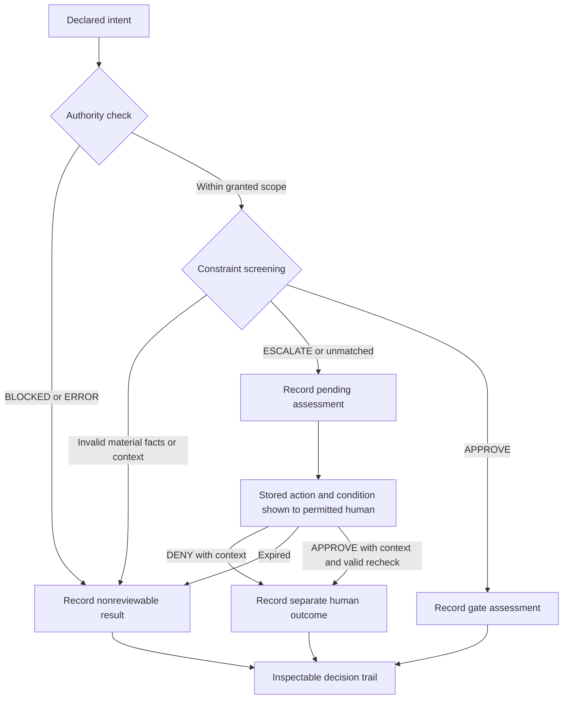

# ADR-0001: Build Apex's transparency workflow from APEX-Lite

**Status:** Proposed full architecture with a bounded v0.0.2 implementation; the Apex name, folder, APEX-Lite starting point, and APPROVE/ESCALATE gate direction were directed by Robert

**Date:** 2026-09-09; current increment updated 2026-09-10

**Decider:** Robert, with implementation and review evidence

**Implementation increment:** [Auditor v0.0.2](../docs/auditor-v0.0.2.md) uses the [Switchboard](../docs/switchboard.md), deterministic APPROVE/ESCALATE rules, a local journal, and one authenticated human-review role. The human records APPROVE or DENY with required context against the stored escalation. Full material-action verification, per-condition human routes, expiry, and execution remain outside this increment.

## Context

Northstar's active goal is the third-party transparency layer described in the [product roadmap](../../docs/roadmap/transparency-layer.md). Existing enforcement work is retained on the back burner. Apex is a separate workspace inside Northstar for designing that layer from APEX-Lite.

The [pinned APEX-Lite source](../reference/README.md) already presents intent, runs deterministic screening, explains a decision, and provides a human queue. It has no authenticated whitelist or grant check and its receipts are nonblocking. Copying it preserves a useful foundation without establishing the authority guarantees Apex requires.

## Proposed decision

Keep APEX-Lite as a frozen reference and evolve its participant workflow into Apex. Define the information and authority boundaries before selecting a new runtime, authentication provider, deployment environment, or UI framework. The first milestone is the [screening and human-verification walkthrough](first-workflow.md).

The proposed responsibilities are:

| Responsibility | What Apex needs | Starting point |
| --- | --- | --- |
| Intent intake | Concrete action, target, material arguments, requested scope, and separate agent explanation | APEX-Lite's declaration form and normalization, with stricter validation |
| Authority screening | Authenticated identity, whitelist, granted action scope, and identifiable grant source | New integration; APEX-Lite has caller-supplied names only |
| Constraint screening | Deterministic APPROVE/ESCALATE over validated action data and trusted context, with explicit reasons and nonreviewable errors | APEX-Lite's readable evaluator as a reference; retained Northstar policy contracts inform live behavior |
| Human verification | Authenticated permitted reviewer, exact stored action, escalation reason, APPROVE/DENY with context, and expiry | APEX-Lite's queue as a presentation reference |
| Transparency record | Linked declaration, identity checks, policy results, human outcome, and separately identified execution evidence | Receipt/feed interaction from APEX-Lite; existing Northstar schemas for any claimed compatibility |
| Execution integration | Only when added: exact authenticated single-use authorization and a separately observed outcome | Retained Northstar authority/adapter work; outside the first walkthrough |

The intended flow is:

This is a design flow, not a deployed enforcement path. The system must record the actual checks behind each explanation. An agent's stated reason is descriptive evidence, not proof of identity, risk classification, or permission. The decision gate supplies APPROVE or ESCALATE. A human can resolve only a saved eligible escalation; they cannot override authority BLOCKED/ERROR or supply a replacement action. Gate and human approval both remain assessment evidence, not execution permission.

## Options considered

| Option | Benefit | Cost or limitation |
| --- | --- | --- |
| Rename APEX-Lite and treat its existing runtime as Apex | Fastest way to display the old console | Carries forward missing authentication, nonblocking decisions, and incomplete approval semantics |
| Reuse APEX-Lite's workflow with explicit authority and evidence boundaries | Keeps the original interaction understandable while making missing guarantees visible | Requires deliberate identity, policy, and evidence integration work |
| Continue from the macOS marker implementation as the product's entry point | Starts from an exercised protected capability | Makes a platform-specific execution demonstration drive the participant workflow again |

The second option is proposed. Preserve the original source for comparison and reuse appropriate code in separately identified Apex implementation files. The existing Rust authority is a reuse candidate, with its actual maturity and open findings retained; using it must not make completing every parked enforcement slice a prerequisite for design.

## Consequences

The design can recover APEX-Lite's direct intent-to-decision experience while making authority, constraints, and human verification explicit. A new live integration will still need authenticated context and trustworthy evidence; a presentation prototype alone cannot provide those properties.

APEX-Lite's receipt names and HTTP endpoints remain historical. This ADR defines neither a new wire protocol nor changes to TL-PX 0.2. The contract mapping, first identity mechanism, and runtime boundary must be resolved before a live authorization path is implemented.

## Current boundary and next design work

The current human review is bound to the assessment ID/hash, requires an operator session and a context comment, and permits one resolution. Approval fails if policy or registry state changed. This makes the review auditable within one local service; removing a gate DENY option alone is not a defense against gaming. The same OS user can access local authority files, and the current assessment covers only agent, action, and target.

Historical journal bytes remain unchanged. When upgrading an old policy, the service appends a fresh comment-only current-model policy and requires new APPROVE/ESCALATE rules. It does not silently translate historical DENY into permission.

The [Apex build plan](../BUILD-PLAN.md) turns this design into sequenced implementation milestones. The architecture status above remains proposed beyond this bounded foundation.

1. Map the first workflow to the original console and identify which fields are declared versus verified.
2. Define the agent registry/grant view and the human approval route shown for each case.
3. Map decision and operator outcomes to retained contract records; identify missing projections or semantics without inventing claims of compatibility.
4. Extend the local auditor with the full material-action walkthrough outside the reference snapshot; retain the current scope and historical evidence labels.
