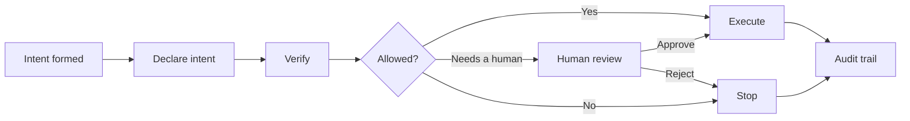
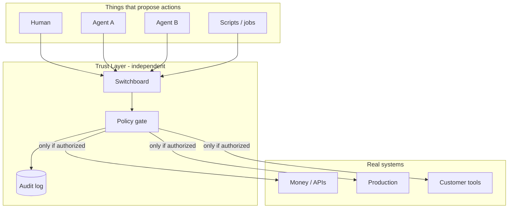
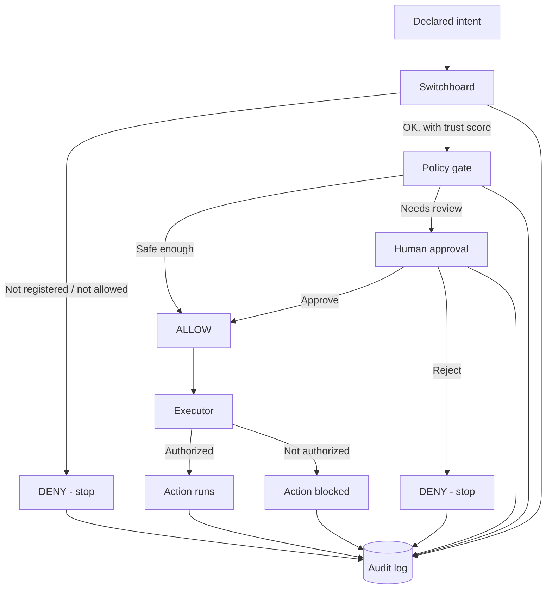
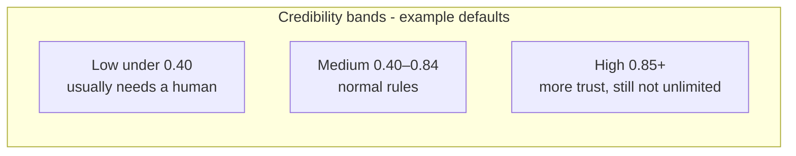
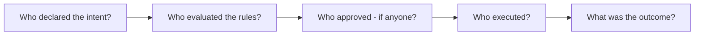
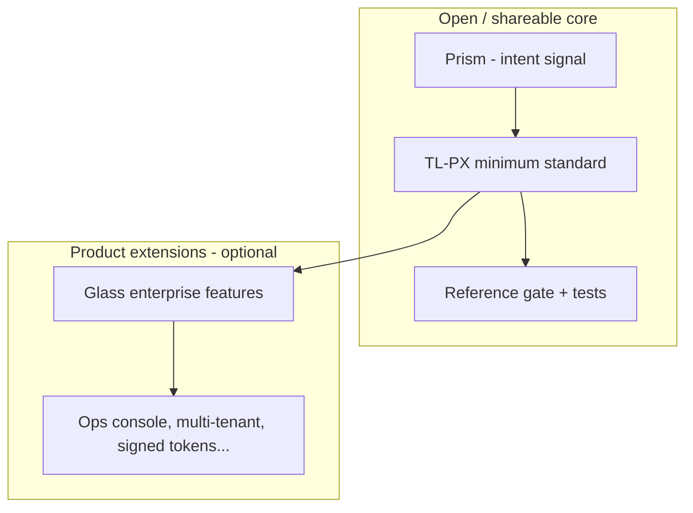
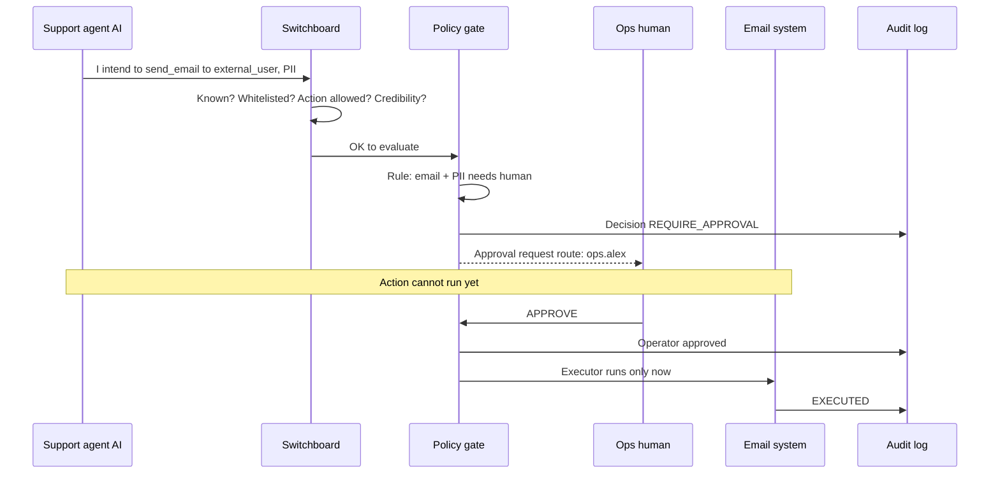

# The Trust Layer  
### A simple overview of pre-execution trust for AI and humans

**What this is:** A plain-language introduction to the Trust Layer idea and the Northstar reference system (TL-PX / Glass / Switchboard).  

**Who it’s for:** Founders, partners, operators, engineers, and anyone who needs the *story* without reading the full technical suite.  

**Status:** Local reference implementation; technical test #1 passed. Designed to work air-gapped (on your machines, without requiring the cloud).

---

## The problem in one sentence

**AI agents can act faster than people can supervise — and logs after the damage are too late.**

When software only *writes text*, a bad answer is embarrassing.  
When software *moves money*, *changes production*, *emails customers*, or *talks to other agents*, a bad action is an incident.

Today, a lot of “AI safety” lives **inside** the model (prompts, refusals, training). That helps. It is not enough for **real-world execution**.

---

## The idea

### Verification *before* execution

The Trust Layer is a **checkpoint between intent and action**:

1. Something (a person or an AI) **declares what it is about to do**  
2. An independent system **checks identity, rules, and risk**  
3. If needed, a **human approves**  
4. Only then may the action **run**  
5. Everything is **written down** so you can see who did what if something goes wrong  



This is the same *kind* of thinking used in other safety-critical domains: pre-flight checks, change control, admission control — **authority outside the thing proposing the action**.

---

## Why “air-gapped” matters

The Trust Layer is designed as an **external** boundary, not a setting buried inside one chatbot product.

- It can run **locally**  
- It does not require the public internet to make a decision  
- Other systems *call* it; they don’t own it  

That means it can sit in front of **many** agents and tools over time — not only one vendor’s coding assistant.



---

## The pieces (simple names)

| Piece | Plain English | One-liner |
| --- | --- | --- |
| **Prism** | The “I intend to…” note | Describes intent. Does **not** approve or deny. |
| **Switchboard** | The bouncer + directory | Who are you? Are you allowed in? How trusted are you? Who should approve you? |
| **Glass / TL-PX gate** | The rulebook | Given this intent + rules, **allow**, **ask a human**, or **deny**. |
| **Human approval** | The supervisor | For higher risk: a person must approve before go. |
| **Executor** | The last lock | Will **not** run the real action unless the gate (and audit) say authorized. |
| **Audit log** | The black box recorder | Append-only history: who declared, who decided, who approved, what ran. |

### How they fit together



**Important order:**  
**Switchboard is first.** If Switchboard denies you, the detailed rulebook never gets a chance to “maybe allow” you. That is intentional.

---

## Identity and credibility (Switchboard)

Every agent or machine should be a known **principal** (like an employee badge):

- **Whitelist** — are you allowed to use this gate at all?  
- **Allowed actions** — are you allowed to do *this kind* of thing?  
- **Credibility score** — **0.00 to 0.99** (never a perfect 1.0)  
- **Approval route** — if a human is needed, *who* gets the ticket?



**Credibility is operator-managed**, not “the AI scored itself.”  
It is a dial humans set (and can adjust after outcomes), so the system stays **predictable**.

---

## Decisions people will see

| Decision | Meaning |
| --- | --- |
| **ALLOW** | Rules say this can proceed without waiting for a person |
| **REQUIRE APPROVAL** | Pause — a human on the approval route must approve |
| **DENY** | Stop — especially access/identity failures from Switchboard |

When something tries to **run**:

| Status | Meaning |
| --- | --- |
| **AUTHORIZED** | Allowed to execute |
| **PENDING** | Waiting on a human |
| **DENIED** | Must not execute |
| **EXECUTED / BLOCKED / FAILED** | What the executor recorded after the attempt |

---

## Accountability (when something goes wrong)

The goal is not blame theater. The goal is a **clear evidence trail**:



Parties can be **human** or **machine**.  
That matters when the failure was:

- a model that mis-declared intent,  
- a policy that was too loose,  
- a human who approved too quickly, or  
- a runtime that ran something it shouldn’t have.

The audit log is a **JSONL** file on disk in the reference system (local, append-only).  
Canonical technical-test log path:

```text
var/tech-test-audit.jsonl
```

---

## What this is *not*

To keep expectations honest:

| It is | It is not |
| --- | --- |
| A pre-execution checkpoint | A promise that every program on Earth is contained |
| A rule + identity system | “The AI has ethics now” |
| Evidence for incident review | Automatic legal judgment of liability |
| Designed for air-gap / local control | Dependent on one cloud vendor to decide |
| Open *minimum standard* direction (TL-PX) | The entire enterprise product surface |

If a system **never calls** the Trust Layer and runs the action anyway, the Trust Layer cannot stop it — just like a door lock cannot stop someone who walks through a hole in the wall. Real deployments must **route sensitive actions through the gate**.

---

## Open “to an extent”

The long-term shape:



- **Open core:** so others can implement the same minimum and pass tests  
- **Product layer:** stronger enterprise capabilities without forking the meaning of “conforming”

---

## Where the project is today (plain status)

| Item | Status |
| --- | --- |
| Idea & architecture | Written and implemented in a local reference repo (**Northstar**) |
| Switchboard (identity + credibility) | Working |
| Air-gapped audit + fail-closed execute | Working |
| Automated tests + conformance | Passing |
| Formal technical test #1 | **Passed (29/29)** |
| Public GitHub for *this* repo | Not required / not pushed by default (local until you choose) |
| Related public pieces | Prism / APEX-Lite / Trust Layer site under Trust-Layer-AI |

---

## A day-in-the-life story

**Scenario:** A support agent wants to email a customer with an attachment that may include personal data.



If the agent was **unknown** or **not whitelisted**, Switchboard would **DENY** immediately — no email, no “please approve this stranger.”

---

## Why this matters now

AI is moving from **answers** to **actions**.  
Organizations will need a shared way to say:

> “Nothing important happens until intent is declared, checked, and — when required — approved — and we can prove that trail later.”

The Trust Layer is that pattern: **simple enough to explain, strict enough to test, open enough to become a minimum standard.**

---

## If you want more depth

| Audience | Document |
| --- | --- |
| Full docs hub | [docs/README.md](./README.md) |
| Hands-on | [getting-started.md](./getting-started.md) |
| Spec (normative) | [standard/SPEC-v0.1.md](./standard/SPEC-v0.1.md) |
| Security honesty | [security.md](./security.md) |

---

## One closing line

**Declare intent. Check who and what. Approve when it matters. Execute only when authorized. Leave a trail.**

That’s the Trust Layer.

---

*Document version: shareable overview · Northstar / TL-PX · local reference · not legal advice · not a patent claim set*
